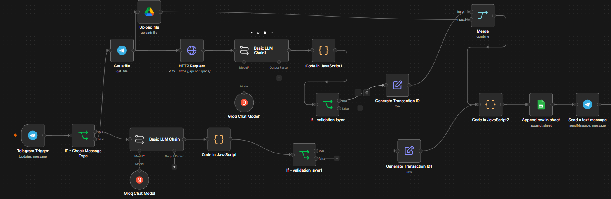
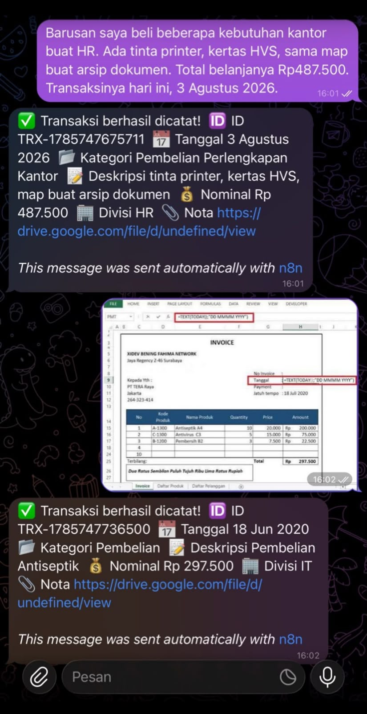
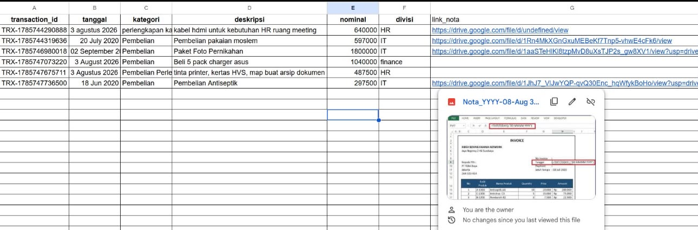

# 🤖 AI Administrative Assistant

An AI-powered administrative expense automation system built with **n8n**.

This workflow allows users to submit expense transactions through **Telegram**, either by sending a text message or uploading a receipt image. The system automatically extracts, validates, processes, and stores the transaction data.

## ✨ Features

- 💬 Text-based expense input via Telegram
- 🧾 Receipt image processing
- 🔎 OCR-based text extraction
- 🤖 AI-powered transaction parsing
- ✅ Transaction validation
- 🆔 Automatic transaction ID generation
- ☁️ Receipt upload to Google Drive
- 📊 Automatic recording to Google Sheets
- 🔗 Automatic receipt link generation
- 📩 Transaction confirmation via Telegram

## 🔄 Workflow

```text
                         Telegram
                            │
              ┌─────────────┴─────────────┐
              │                           │
          Text Input                 Receipt Image
              │                           │
          AI Parser                    OCR
              │                           │
          Validation                  AI Parser
              │                           │
              └─────────────┬─────────────┘
                            │
                       Validation
                            │
                    Transaction ID
                            │
                          Merge
                            │
                     Data Processing
                            │
                      Google Sheets
                            │
                    Telegram Reply
```

## 🛠️ Tech Stack

- **n8n** — Workflow automation
- **Telegram Bot API** — User interaction
- **Groq** — LLM inference
- **Llama 3.3 70B** — AI transaction parsing
- **OCR.Space** — Receipt text extraction
- **Google Drive** — Receipt storage
- **Google Sheets** — Transaction database
- **JavaScript** — Data transformation and processing

## 🧠 How It Works

The system accepts two types of input:

### 1. Text Transaction

Users can simply send a message such as:

> Beli printer untuk divisi HR sebesar 1,5 juta.

The AI converts the unstructured message into structured transaction data.

### 2. Receipt Image

Users can upload a receipt image through Telegram.

The workflow then:

1. Retrieves the image from Telegram
2. Uploads the receipt to Google Drive
3. Extracts text using OCR
4. Sends the OCR result to the LLM
5. Extracts structured transaction information
6. Validates the extracted data
7. Generates a transaction ID
8. Stores the transaction in Google Sheets
9. Sends a confirmation message back to Telegram

## 📋 Example

### Input

```text
Beli printer untuk divisi HR sebesar 1,5 juta.
```

### AI Output

```json
{
  "tanggal": "14 August 2026",
  "kategori": "Pembelian",
  "deskripsi": "Pembelian printer",
  "nominal": 1500000,
  "divisi": "HR"
}
```

## 📸 Workflow Preview

### n8n Automation Workflow



### Telegram Input



### Google Sheets Output



## 🎯 Purpose

This project demonstrates how **AI and workflow automation** can reduce repetitive administrative data entry.

Instead of manually transferring transaction information from messages or receipts into spreadsheets, the workflow automates the process from **input → extraction → validation → storage → confirmation**.

The project was built as a practical portfolio project to explore the implementation of **LLM-powered automation in administrative workflows**.

## 🔐 Security

Credentials, API keys, and sensitive authentication information are not included in this repository.

Users must configure their own credentials before running the workflow.

## 📁 Repository Structure

```text
ai-administrative-assistant/
│
├── workflow/
│   └── ai-administrative-assistant.json
│
├── screenshots/
│   ├── workflow-overview.png
│   ├── telegram-input.jpg
│   └── google-sheets-output.jpg
│
└── README.md
```

## 📌 Project Status

**Prototype / Portfolio Project**

This project demonstrates practical experience with:

- AI Workflow Automation
- LLM Integration
- Prompt Engineering
- OCR Processing
- API Integration
- JavaScript
- Data Transformation
- Administrative Process Automation

## 👤 Author

**Muhammad Zaki**

GitHub: [MuhammadZaki1709](https://github.com/MuhammadZaki1709)
